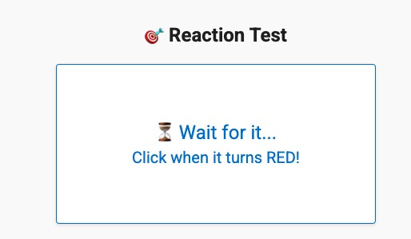

<strong style="font-size: 1.5rem;">Hey, I'm Jovylle</strong>

Fullstack Web Developer · JS / PHP / Vue / React / Laravel · Since 2017

  

---

About Me

> `Ctrl+Z is my best friend.`

- I like breaking things apart  
- I poke around until something useful comes out

---

🧰 Tech Stack

  
  
  
  
  
  
  
  
  
  
  
  
  
  
  
  
  
  

---

  

---

🚀 Professional Highlights

<table align="center">
<tr>
  <td align="center" width="50%" style="vertical-align: top; padding: 20px;">
    <h3 style="color: #2F81F7; margin-bottom: 8px;">Chat Widget</h3>
    
<strong style="background: #f6f8fa; padding: 2px 8px; border-radius: 12px; font-size: 0.85em;">Chatbot / AI</strong>

    
A super-lightweight, open-source GPT-powered chatbot you can drop into any static site in seconds. Zero-config embed with just two `<script>` tags, serverless Netlify Function backend to proxy OpenAI calls, fully customizable UI, MIT-licensed, and supports per-user routes and analytics integrations.
    

      
    
  </td>
  <td align="center" width="50%" style="vertical-align: top; padding: 20px;">
    <h3 style="color: #2F81F7; margin-bottom: 8px;">Game Tools & Community Feedback</h3>
    
<strong style="background: #f6f8fa; padding: 2px 8px; border-radius: 12px; font-size: 0.85em;">Game Dev Tools</strong>

    
Built sfl.uft1.com - a real-time game assistant used daily by hundreds of Sunflower Land players. Created Vue 3/Vite tools with game API integration for strategy optimization. Collected community feedback for continuous UX improvement.
    

      
    
  </td>
</tr>
<tr>
  <td align="center" width="50%" style="vertical-align: top; padding: 20px;">
    <h3 style="color: #2F81F7; margin-bottom: 8px;">Full Stack Deployment with Laravel & Next.js</h3>
    
<strong style="background: #f6f8fa; padding: 2px 8px; border-radius: 12px; font-size: 0.85em;">DevOps / Full Stack</strong>

    
Deployed full-stack apps on Linux/Nginx, managed MySQL, and used serverless APIs with Python + GCP.
  </td>
  <td align="center" width="50%" style="vertical-align: top; padding: 20px;">
    <h3 style="color: #2F81F7; margin-bottom: 8px;">Frontend UI/UX Craftsmanship</h3>
    
<strong style="background: #f6f8fa; padding: 2px 8px; border-radius: 12px; font-size: 0.85em;">Frontend</strong>

    
Expert in converting Figma designs to pixel-perfect responsive interfaces using Vue 3, Nuxt, React, and TailwindCSS. Implemented GSAP/Sal.js animations and mobile-first architectures for optimal user experiences.
  </td>
</tr>
<tr>
  <td align="center" width="50%" style="vertical-align: top; padding: 20px;">
    <h3 style="color: #2F81F7; margin-bottom: 8px;">Real-Time API Integrations</h3>
    
<strong style="background: #f6f8fa; padding: 2px 8px; border-radius: 12px; font-size: 0.85em;">API / Realtime</strong>

    
Integrated OpenAI, OpenWeather, and game APIs. Automated data fetch with Puppeteer.
  </td>
  <td align="center" width="50%" style="vertical-align: top; padding: 20px;">
    <h3 style="color: #2F81F7; margin-bottom: 8px;">Chrome Extensions with Game Automation</h3>
    
<strong style="background: #f6f8fa; padding: 2px 8px; border-radius: 12px; font-size: 0.85em;">Extensions</strong>

    
Created browser extensions for Melvor Idle (5.0★ rating) & Sunflower Land with 200+ active users. Built DOM injection, hotkey bindings, task automation, and local storage management for enhanced gameplay experiences.
  </td>
</tr>
</table>

---

  
⚡ Reaction Game Leaderboard

  
   
  
   
  

    🏆 Best: 339ms • 📅 Updated: 10/22/2025
  

<table align="center" style="border-collapse: collapse; width: 100%; max-width: 600px;">
  <thead>
    <tr style="background: #f6f8fa;">
      <th style="padding: 12px; text-align: center; border: 1px solid #d0d7de;">🏆</th>
      <th style="padding: 12px; text-align: left; border: 1px solid #d0d7de;">Player</th>
      <th style="padding: 12px; text-align: center; border: 1px solid #d0d7de;">Time</th>
      <th style="padding: 12px; text-align: center; border: 1px solid #d0d7de;">Date</th>
    </tr>
  </thead>
  <tbody>
    <tr style="background: #ffffff;">
      <td style="padding: 12px; text-align: center; border: 1px solid #d0d7de; font-size: 1.2em;">🥇</td>
      <td style="padding: 12px; text-align: left; border: 1px solid #d0d7de; font-weight: 500;">BraveBard</td>
      <td style="padding: 12px; text-align: center; border: 1px solid #d0d7de; font-weight: bold; color: #dc3545; background: #e6ffed;">339ms</td>
      <td style="padding: 12px; text-align: center; border: 1px solid #d0d7de; font-size: 0.9em; color: #666;">10/22/2025</td>
    </tr>
    <tr style="background: #f6f8fa;">
      <td style="padding: 12px; text-align: center; border: 1px solid #d0d7de; font-size: 1.2em;">🥈</td>
      <td style="padding: 12px; text-align: left; border: 1px solid #d0d7de; font-weight: 500;">BraveMonk222</td>
      <td style="padding: 12px; text-align: center; border: 1px solid #d0d7de; font-weight: bold; color: #dc3545; ">344ms</td>
      <td style="padding: 12px; text-align: center; border: 1px solid #d0d7de; font-size: 0.9em; color: #666;">10/22/2025</td>
    </tr>
    <tr style="background: #ffffff;">
      <td style="padding: 12px; text-align: center; border: 1px solid #d0d7de; font-size: 1.2em;">🥉</td>
      <td style="padding: 12px; text-align: left; border: 1px solid #d0d7de; font-weight: 500;">BraveMonk222</td>
      <td style="padding: 12px; text-align: center; border: 1px solid #d0d7de; font-weight: bold; color: #dc3545; ">361ms</td>
      <td style="padding: 12px; text-align: center; border: 1px solid #d0d7de; font-size: 0.9em; color: #666;">10/22/2025</td>
    </tr>
    <tr style="background: #f6f8fa;">
      <td style="padding: 12px; text-align: center; border: 1px solid #d0d7de; font-size: 1.2em;">4️⃣</td>
      <td style="padding: 12px; text-align: left; border: 1px solid #d0d7de; font-weight: 500;">FlashPro5</td>
      <td style="padding: 12px; text-align: center; border: 1px solid #d0d7de; font-weight: bold; color: #dc3545; ">363ms</td>
      <td style="padding: 12px; text-align: center; border: 1px solid #d0d7de; font-size: 0.9em; color: #666;">10/21/2025</td>
    </tr>
    <tr style="background: #ffffff;">
      <td style="padding: 12px; text-align: center; border: 1px solid #d0d7de; font-size: 1.2em;">5️⃣</td>
      <td style="padding: 12px; text-align: left; border: 1px solid #d0d7de; font-weight: 500;">FlashPro5</td>
      <td style="padding: 12px; text-align: center; border: 1px solid #d0d7de; font-weight: bold; color: #dc3545; ">369ms</td>
      <td style="padding: 12px; text-align: center; border: 1px solid #d0d7de; font-size: 0.9em; color: #666;">10/21/2025</td>
    </tr>
  </tbody>
</table>

  <small style="color: #ff6b6b; font-weight: 500;">🔄 Resets every 3 months</small>

---

📊 Stats

  
  
  

